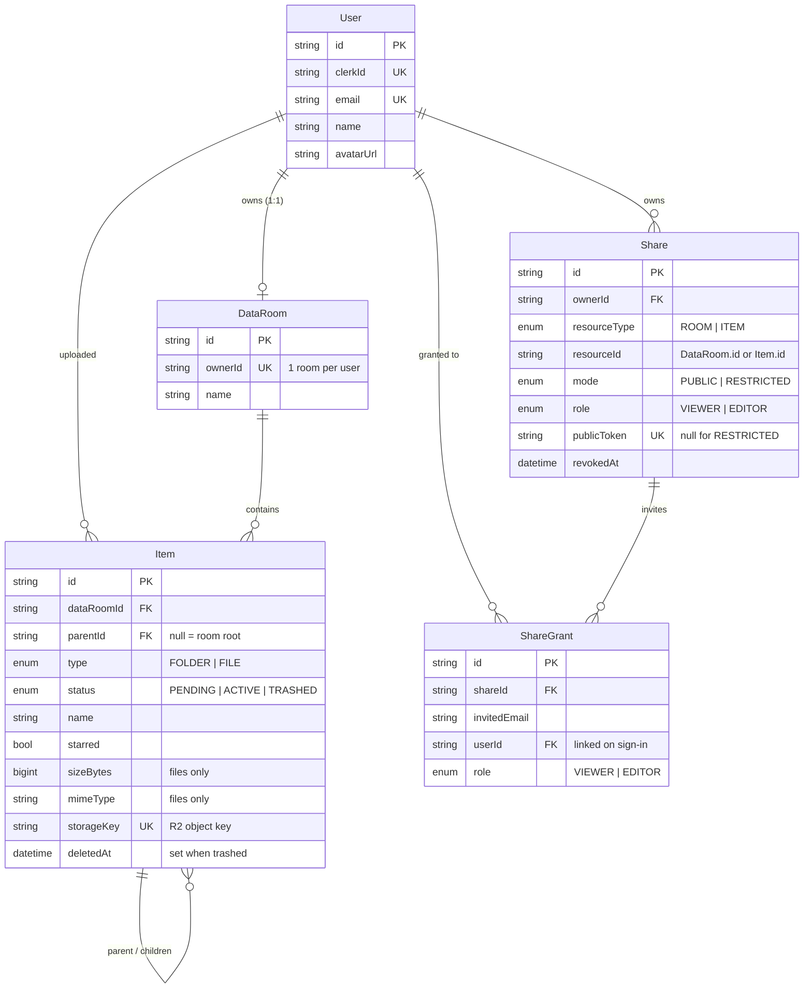

# Data Room

A secure, Google Drive–style **Data Room** for due-diligence: upload, organize, preview and share documents. A Data Room is a private, top-level drive that belongs to a single owner and is invisible to everyone else unless explicitly shared — via a **public link** or a **permissioned invite** — always read-only for recipients.

Full-stack, deployed end-to-end: **NestJS + PostgreSQL + Prisma** API, **Next.js (App Router)** web app, **Cloudflare R2** blob storage, **Clerk** authentication.

> **Live demo** — Web: `https://<your-vercel-app>.vercel.app` · API health: `https://<your-api-host>/api/health`
> _(replace with the deployed URLs once hosted — see [Deployment](#deployment))_

---

## Table of contents

- [Features](#features)
- [Tech stack](#tech-stack)
- [Architecture](#architecture)
- [Data model (ERD)](#data-model-erd)
- [How it scales](#how-it-scales)
- [File storage & upload flow](#file-storage--upload-flow)
- [Sharing model](#sharing-model)
- [Getting started](#getting-started)
- [API reference](#api-reference)
- [Design decisions](#design-decisions)
- [Edge cases handled](#edge-cases-handled)
- [Internationalization](#internationalization)
- [Deployment](#deployment)
- [Use of AI](#use-of-ai)
- [Roadmap / trade-offs](#roadmap--trade-offs)

---

## Features

**Folders**
- Create folders and nest them arbitrarily deep.
- Browse a folder and its contents with **breadcrumb** navigation; a lazy-loading folder tree in the sidebar.
- Rename a folder.
- Delete a folder — the confirmation **warns exactly what will be removed** (file/folder counts + total size of the whole subtree).

**Files** (PDF)
- Upload **multiple files at once**, **drag-and-drop** (files *and* whole folders), with **per-file progress**, cancel and retry.
- **Preview** a PDF in-app.
- Rename a file, with **in-folder name-conflict resolution**.
- **Move** a file (or folder) to another folder — via a picker dialog or drag-and-drop onto the tree.
- Delete to **Trash** (soft delete, restorable) and **delete forever**.

**Sharing**
- Share a **Data Room**, a **folder**, or a single **file**; recipients get **read-only** access, including all nested content.
- Two modes: **public link** (anyone with the link) and **restricted** (only invited emails).
- The owner can **revoke** access at any time.

**Extra**
- **Cross-room search** by name (⌘K palette + a results page with type/date/owner filters).
- **Starred** items and a Google-Drive-style **home** dashboard.
- Trilingual UI **and** API messages (Ukrainian / Russian / English).

---

## Tech stack

| Layer | Choice |
| --- | --- |
| Monorepo | pnpm workspaces (`apps/*`, `packages/*`), Node ≥ 22 |
| Backend | NestJS 11, Prisma 6, PostgreSQL |
| Frontend | Next.js 16 (App Router), React 19, TypeScript, Tailwind CSS v4, shadcn-style UI, TanStack Query |
| Auth | Clerk (`@clerk/nextjs`) — Google, Apple, email + password, email-code |
| Blob storage | Cloudflare R2 (S3-compatible), presigned upload/download URLs |
| Shared code | `@dataroom/types` — response DTOs + enums shared by API and web |
| i18n | `next-intl` (web) + a small server-side message catalog (API) |

---

## Architecture

```
.
├── apps/
│   ├── api/                 # NestJS API (Prisma, Clerk guard, R2, i18n error catalog)
│   │   ├── src/
│   │   │   ├── items/       # folders + files: listing, upload, move, trash, stats, search
│   │   │   ├── shares/      # owner shares + public-link + grantee read surfaces
│   │   │   ├── data-rooms/  # the single per-user room (read / rename / stats)
│   │   │   ├── storage/     # R2 presigning
│   │   │   ├── common/      # response envelope, exception filter, i18n, auth guard
│   │   │   └── prisma/
│   │   └── prisma/          # schema.prisma + migrations
│   └── web/                 # Next.js app (client-rendered; calls the API with a bearer token)
│       └── src/
│           ├── app/         # App Router routes (drive, folders, trash, starred, search, /s/[token], /shared/[id])
│           ├── features/    # items, shares, shell, auth, search, home
│           ├── i18n/        # locale config + messages/{en,ru,uk}.json
│           └── lib/         # api-client, query keys
└── packages/types/          # shared DTOs + enums
```

**Request flow.** The web app is fully client-rendered. Clerk issues a session token in the browser; every API call sends it as `Authorization: Bearer …`. A NestJS guard verifies the token, **just-in-time provisions** a local `User` + their `DataRoom` on first sight, and attaches the user to the request. Every response is a single envelope:

```jsonc
{ "data": <T> | null, "error": { "code": "NOT_FOUND", "message": "…", "details": {…} } | null }
```

Errors are localized to the caller’s UI language (an `X-Locale` header, falling back to `Accept-Language`), so backend messages are shown in the user’s language just like the rest of the UI.

---

## Data model (ERD)



Key modeling choices:

- **Unified node tree.** Folders and files are one `Item` table distinguished by `type`, using an **adjacency list** (`parentId`). This mirrors Google Drive, keeps moves an `O(1)` parent update, and lets one set of indexes serve both.
- **One Data Room per user**, auto-created on signup (`DataRoom.ownerId` is unique).
- **Upload lifecycle** via `status`: a file is `PENDING` before the blob lands and `ACTIVE` after finalize; folders are `ACTIVE` immediately. `TRASHED` is a soft delete. **Every read filters `status = 'ACTIVE'`**, so half-finished uploads and trashed items simply don’t exist to listings, stats, or name checks.
- **Polymorphic shares.** `Share.resourceId` points at either a `DataRoom` or an `Item` (`resourceType`), so one table covers all three share targets; referential integrity is enforced in the service layer.
- **Roles baked in early.** `ShareRole { VIEWER, EDITOR }` and a `role` column exist on both `Share` and `ShareGrant` even though the MVP only reads — see [How it scales](#how-it-scales).

---

## How it scales

The three questions from the brief, answered against the real implementation.

### a) Total size & item count of a folder, including its whole subtree

A single **recursive CTE** (`WITH RECURSIVE`) walks from the target node down through every descendant and aggregates in one round-trip — no denormalized counters to keep in sync:

```sql
SELECT
  COUNT(*) FILTER (WHERE type = 'FILE')                              AS file_count,
  COUNT(*) FILTER (WHERE type = 'FOLDER')                            AS folder_count,
  COALESCE(SUM("sizeBytes") FILTER (WHERE type = 'FILE'), 0)::bigint AS total_bytes
FROM subtree;   -- subtree = recursive descent from :rootId, status = 'ACTIVE'
```

(`ItemsService.computeSubtreeStats`.) Each recursion step is an index lookup on `@@index([parentId])`. The cost is `O(subtree)` and always correct; because it’s computed on demand, **writes stay cheap** (no counter fan-out). If read latency ever mattered for very large subtrees, we’d cache per-folder rollups invalidated on writes — without changing the schema.

### b) What changes at 100,000 files (listing, pagination, indexes)

- **Keyset (cursor) pagination**, never `OFFSET`. Each page is a tuple comparison `(type, sortVal, id) > (cursor)` read straight off the composite index `@@index([dataRoomId, parentId, type, name])`. Page 10,000 costs the same as page 1 — no deep-offset scan. Folders always group first (`type ASC`), and the cursor is opaque and carries its sort context so a stale cursor can’t be replayed under a different order.
- **Indexes cover every hot path**: folders-first listing, Trash (`[dataRoomId, status]`), Starred (`[dataRoomId, starred]`), uploader lookups (`[uploadedById]`).
- **Name uniqueness** is enforced by two **partial `UNIQUE` indexes** (ACTIVE rows only — one for nested items, one for the room root), not application checks. Concurrent same-name creates can’t both win: the loser hits a unique violation and **auto-suffixes** (`Report (1)`) on retry.
- **Bytes never flow through the API.** Uploads and downloads are **presigned R2 URLs**, so a 100k-file room never pushes file traffic through the Node process — it only issues short-lived signatures.
- **Search** is a room-scoped `ILIKE` substring match (LIKE metacharacters escaped), capped and folders-first. It lives behind one endpoint, so scaling it is a localized change: add a `pg_trgm` GIN index or Postgres full-text search when substring scans stop being cheap.

### c) Per-user roles (viewer/editor) without remodeling

The model is already shaped for it: `ShareRole { VIEWER, EDITOR }` plus a `role` column on **both** `Share` and `ShareGrant` (default `VIEWER`). The MVP only reads, so only `VIEWER` is exercised, but the shared-access resolver already returns a `role` for every request. Enabling editing is a **behavior change, not a migration**: honor `role === 'EDITOR'` in the write paths (create/rename/move/delete within a shared scope) and add a role selector to the invite UI. Nothing in the schema moves.

---

## File storage & upload flow

Uploads are **PDF-only**, capped at **100 MB**, and the API never proxies bytes. It’s a two-phase, presigned flow:

1. **Presign** — `POST /api/uploads/presign` validates type + size, reserves a unique name, creates a hidden **`PENDING`** file row, and returns a presigned R2 `PUT` URL.
2. **Client → R2** — the browser `PUT`s the bytes straight to R2 with per-file progress.
3. **Finalize** — `POST /api/items/:id/finalize` re-reads the **authoritative** object size from R2 (the client-reported size is never trusted), stamps `uploadedAt`, and flips the row to **`ACTIVE`** — only now is the file visible.

Deletes remove the R2 objects for the whole subtree **before** the DB rows, so a crash can only ever leave a retryable row, never an orphaned blob. Downloads/previews are short-lived presigned `GET` URLs (`attachment` vs `inline`).

---

## Sharing model

- **What can be shared:** a whole Data Room (`ROOM`), or any single folder/file (`ITEM`) — the latter grants access to that item **and its subtree**.
- **Public link:** a `Share` with a random `publicToken`; anyone with `/s/<token>` gets read-only access. The API resolves the token to a scope and confines every read to it.
- **Restricted:** a `Share` with `ShareGrant` rows (one per invited email). A grantee is matched by linked `userId` or by invited email; a caller with no matching grant gets a **404, not a 403** (no existence leak).
- **Revoke:** setting `revokedAt` makes every access check treat the share as gone (idempotent).
- **Scope safety:** shared reads re-resolve the target and clamp navigation to the shared subtree — an out-of-scope id (a sibling folder, another room) resolves to 404. A shared item that was since trashed/deleted resolves to nothing, so viewers can’t read stale content.

---

## Getting started

### Prerequisites

- **Node ≥ 22** and **pnpm 10** (`corepack enable`)
- **PostgreSQL 16** (local, Docker, or Neon)
- A **Clerk** application (publishable + secret keys)
- A **Cloudflare R2** bucket + API token _(optional for browsing; required for uploads)_

### 1. Install

```bash
pnpm install
pnpm --filter @dataroom/types build   # build shared types first
```

### 2. Configure environment

Copy the two blocks from [`.env.example`](./.env.example) into **`apps/api/.env`** and **`apps/web/.env.local`** and fill in real values (Postgres URL, Clerk keys, R2 credentials). Secrets are gitignored.

### 3. Database

```bash
pnpm db:up                              # start Postgres via docker-compose (or use your own)
pnpm --filter @dataroom/api run prisma:generate
pnpm --filter @dataroom/api run prisma:deploy   # apply migrations
```

### 4. Run

```bash
pnpm --filter @dataroom/api run start:dev   # API  → http://localhost:3000
pnpm --filter @dataroom/web dev             # web  → http://localhost:3001
```

Open **http://localhost:3001**. In Clerk’s dev mode you can register with `anything+clerk_test@example.com` and the verification code `424242`.

### Useful scripts

```bash
pnpm typecheck        # tsc across all packages
pnpm lint             # eslint (api) + oxlint (web)
pnpm --filter @dataroom/api run prisma:studio   # inspect the DB
```

---

## API reference

All routes are under the `/api` prefix and (except the public/health surface) require a Clerk bearer token. Every response uses the `{ data, error }` envelope.

| Method | Path | Purpose |
| --- | --- | --- |
| `GET` | `/api/health` | Liveness + DB check |
| `GET` | `/api/me` | Current user |
| `GET` `PATCH` | `/api/me/room` | Read / rename the caller’s Data Room |
| `GET` | `/api/me/room/stats` | Whole-room file/folder counts + size |
| `GET` | `/api/items?parentId=&cursor=&limit=&sort=&dir=` | List one folder level (keyset) |
| `GET` | `/api/items/search?q=&limit=` | Cross-room name search |
| `POST` | `/api/folders` | Create a folder |
| `GET` `PATCH` `DELETE` | `/api/items/:id` | Get / rename-move-star / trash |
| `GET` | `/api/items/:id/breadcrumb` | Ancestor trail |
| `GET` | `/api/items/:id/stats` | Subtree size + counts |
| `POST` | `/api/uploads/presign` | Reserve a file + get an R2 upload URL |
| `POST` | `/api/items/:id/finalize` | Confirm an upload → ACTIVE |
| `GET` | `/api/items/:id/preview` \| `/download` | Presigned read URL |
| `GET` | `/api/trash` · `/api/starred` | Trash / starred listings |
| `POST` `DELETE` | `/api/items/:id/restore` · `/api/trash/:id` · `/api/trash` | Restore / delete-forever / empty |
| `POST` `GET` `DELETE` | `/api/shares` … `/:id/grants` … `/:id` | Create / list / invite / revoke shares |
| `GET` | `/api/public/shares/:token/**` | Anonymous public-link read surface |
| `GET` | `/api/shared` · `/api/shared/:shareId/**` | Invited-user read surface |

---

## Design decisions

- **Adjacency-list tree over materialized paths / nested sets.** Moves are a single `parentId` update; recursive reads (breadcrumb, subtree stats, cascade) are expressed as recursive CTEs, which Postgres handles well and which stay correct under concurrent writes.
- **`status`-gated visibility instead of hard deletes.** `PENDING`/`ACTIVE`/`TRASHED` on one column powers the upload handshake, the Trash, and name-uniqueness with one mechanism — reads simply filter `ACTIVE`.
- **Partial unique indexes for name collisions**, not app-level “does this name exist?” checks — the database is the arbiter, so races resolve deterministically.
- **Presigned direct-to-R2 transfers** keep large files off the API process and make horizontal scaling trivial.
- **Single response envelope + typed error codes**, shared via `@dataroom/types`, so the client has one predictable shape and can localize errors by code.
- **Clerk for auth** to focus effort on the Data Room domain rather than rebuilding session/OAuth/verification; local `User`/`DataRoom` rows are JIT-provisioned on first authenticated request.
- **Client-rendered Next.js** talking to a standalone Nest API — a clean, deployable front/back split rather than coupling data fetching to SSR.

---

## Edge cases handled

- **Same-name upload/create** → silent auto-suffix (`Report (1)`), race-safe via partial unique indexes + retry.
- **Rename/move name clash** → `409` with a `suggestedName` the UI offers in one click.
- **Move a folder into itself or its own descendant** → rejected (`400`) via a subtree containment check.
- **Deleting a folder** → the confirm dialog shows the exact subtree impact (counts + size) before proceeding.
- **A shared item is trashed/deleted while a recipient is viewing it** → shared reads re-resolve against `ACTIVE` rows, so it cleanly resolves to `404` instead of leaking stale content.
- **Foreign or missing resource** → `404`, never `403` (no existence disclosure).
- **Untrusted client size** at upload → the authoritative size is re-read from R2 on finalize.
- **Trash retention** → trashed items auto-purge (blobs included) after 30 days, swept lazily on Trash reads/writes.

---

## Internationalization

The app is fully trilingual — **Ukrainian, Russian, English** — on both ends:

- **Web:** `next-intl`, cookie-based (no locale in the URL), with `messages/{en,ru,uk}.json` as the single source of truth and a locale switcher.
- **API:** error/toast messages are localized server-side from a stable message-key catalog; the web client sends its active locale as `X-Locale`, so a backend error appears in the user’s language, consistent with the rest of the UI.

---

## Deployment

Recommended targets (front and back are independently deployable):

| Piece | Host |
| --- | --- |
| Web (`apps/web`) | **Vercel** |
| API (`apps/api`) | **Railway** (or Fly/Render) |
| Database | **Neon** (serverless Postgres) |
| Blob storage | **Cloudflare R2** |

Checklist:

1. Provision Postgres (Neon) and run `prisma migrate deploy` against it.
2. Deploy the API with the backend env vars; set `CORS_ORIGIN` to the web origin and configure the R2 bucket CORS to allow it.
3. Deploy the web app with `NEXT_PUBLIC_API_URL` pointing at the API and the Clerk keys set.
4. Point Clerk’s allowed origins/redirects at the production web URL.
5. Smoke-test the full flow on prod (sign in → upload → share) and fill the live URLs into the [top of this README](#data-room).

---

## Use of AI

This project was built **with heavy AI assistance (Anthropic’s Claude, via Claude Code)**, used as a pair-engineer throughout:

- **Architecture & planning** — the blueprint (`ARCHITECTURE.md`) was produced with a multi-agent planning pass, then reviewed and refined by hand.
- **Implementation** — features were built one at a time (auth → items → files/R2 → sharing → polish), with AI writing the bulk of the code against a human-set scope and reviewed before moving on.
- **Review, refactoring & i18n** — AI ran code reviews, drove the internationalization sweep (frontend + backend), and helped with edge-case hardening.

Scope, product decisions, trade-offs, and the final review of each feature were human-directed; the AI accelerated the work rather than replacing the judgment.

---

## Roadmap / trade-offs

Deliberately out of scope for the MVP (and how they’d slot in):

- **File versioning on name conflicts** — currently resolved by auto-suffix; a `version` chain on `Item` (or an `ItemVersion` table) would add history without touching the tree model.
- **Editor role** — schema is ready (`ShareRole.EDITOR`); only the write-path enforcement + invite UI remain.
- **Server-side folder pagination for the picker/tree** (currently the first 100), and **trigram/full-text search** at large scale.
- **Background sweeper** for long-pending uploads (today they’re invisible and harmless).
